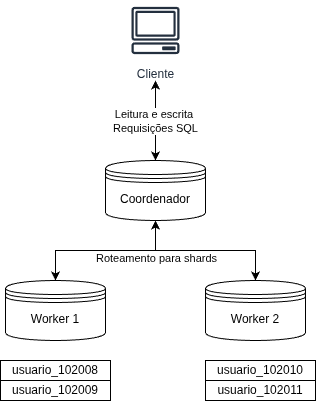

# Sharding automático no PostgreSQL com Citus

Este repositório disponibiliza uma estrutura de contêineres para implantar um ambiente PostgreSQL com distribuição de dados (sharding) entre instâncias utilizando Citus.

O ambiente possui três contêineres:

- `coordinator`: Instância principal onde os dados são gerenciados
- `worker-101`: Instância responsável por armazenar parte dos shards distribuídos pelo coordinator
- `worker-102`: Instância responsável por armazenar parte dos shards distribuídos pelo coordinator

As três instâncias são baseadas na imagem `citusdata/citus`, que corresponde a uma imagem do PostgreSQL configurada com a extensão do Citus.



## Citus

Citus é uma extensão do PostgreSQL que transforma uma instância convencional em um banco de dados distribuído. Ele adiciona um nó **coordinator** responsável por planejar e rotear as consultas, e múltiplos nós **workers** que armazenam e processam os dados em paralelo, mantendo total compatibilidade com SQL padrão.

## Sharding

Sharding é uma técnica de particionamento horizontal que divide os dados de uma tabela em fragmentos menores chamados **shards**, distribuídos entre múltiplos nós. Cada nó armazena apenas uma parte dos dados, permitindo que leituras e escritas ocorram em paralelo.

No Citus, o coordinator recebe as consultas e as roteia para os workers responsáveis pelos shards correspondentes. A distribuição é feita com base em uma **coluna de distribuição** (no caso, `id`), e cada shard é mapeado para um intervalo de valores dessa coluna.

## Teste com ambiente PostgreSQL

### Inicialização

Para implantar o ambiente, utilize o comando:

```bash
docker compose up -d --build
```

Para verificar se os contêineres foram inicializados corretamente, verifique o status com `docker ps -a`.

### Configuração das instâncias

Na instância coordenadora, acesse a ferramenta `psql` com o comando:

```bash
docker exec -it coordinator psql -U postgres
```

Dentro do prompt, adicione `worker-101` e `worker-102` ao cluster com os comandos:

```sql
-- Configura a própria instância como coordenadora
SELECT citus_set_coordinator_host('coordinator', 5432);

-- Configura o primeiro worker como nó do cluster
SELECT * from citus_add_node('worker-101', 5432);

-- Configura o segundo worker como nó do cluster
SELECT * from citus_add_node('worker-102', 5432);
```

Para verificar se os nós foram configurados, utilize o comando:

```sql
SELECT * FROM citus_get_active_worker_nodes();
```

### Criação e distribuição de uma tabela

No mesmo prompt, crie uma tabela:

```sql
CREATE TABLE usuarios (
    id SERIAL PRIMARY KEY,
    nome VARCHAR(255) NOT NULL,
    data_nascimento DATE NOT NULL,
    email VARCHAR(255) NOT NULL,
    telefone VARCHAR(255) NOT NULL
);
```

Para fazer a distribuição da tabela entre os workers, utilize o comando:

```sql
SELECT create_distributed_table('usuarios', 'id');
```

### Inserção de dados

Popule a tabela com o seguinte comando:

```sql
INSERT INTO usuarios (
    nome,
    data_nascimento,
    email,
    telefone
)
SELECT
    'Usuario ' || g,
    CURRENT_DATE,
    'user' || g || '@email.com',
    '(49)99999-' || g
FROM generate_series(1,100000) g;
```

### Validação

Com o comando `\d+` no `coordinator`, é possível verificar a existência de duas views: `citus_schemas` e `citus_tables`. Como a distribuição foi realizada sobre uma tabela, devemos verificar a tabela `citus_tables`:

```sql
SELECT * FROM citus_tables:
```

Com o comando acima, é possível verificar que a tabela `usuarios` está registrada como `distributed`, indicando que o Citus distribuiu ela automaticamente em 32 shards:

```
 table_name | citus_table_type | distribution_column | colocation_id | table_size | shard_count | table_owner | access_method 
------------+------------------+---------------------+---------------+------------+-------------+-------------+---------------
 usuarios   | distributed      | id                  |             1 | 13 MB      |          32 | postgres    | heap
```

A quantidade padrão de shards é definida pela variável `citus.shard_count`. Por padrão, ela é definida como 32, mas pode ser ajustada de acordo com o contexto com o comando:

```sql
SET citus.shard_count TO 32;
```

Para verificar os metadados das shards geradas pelo Citus, pode-se utilizar o comando:

```sql
SELECT * from pg_dist_shard;
```

O resultado do comando mostra a relação (tabela) à qual a shard está relacionada, o identificador da shard, o tipo de armazenamento e os valores usados como critério para inclusão de registros:

```
 logicalrelid | shardid | shardstorage | shardminvalue | shardmaxvalue 
--------------+---------+--------------+---------------+---------------
 usuarios     |  102008 | t            | -2147483648   | -2013265921
 usuarios     |  102009 | t            | -2013265920   | -1879048193
 usuarios     |  102010 | t            | -1879048192   | -1744830465
 usuarios     |  102011 | t            | -1744830464   | -1610612737
 usuarios     |  102012 | t            | -1610612736   | -1476395009
 usuarios     |  102013 | t            | -1476395008   | -1342177281
 usuarios     |  102014 | t            | -1342177280   | -1207959553
 usuarios     |  102015 | t            | -1207959552   | -1073741825
 usuarios     |  102016 | t            | -1073741824   | -939524097
 usuarios     |  102017 | t            | -939524096    | -805306369
 usuarios     |  102018 | t            | -805306368    | -671088641
 usuarios     |  102019 | t            | -671088640    | -536870913
 usuarios     |  102020 | t            | -536870912    | -402653185
 usuarios     |  102021 | t            | -402653184    | -268435457
 usuarios     |  102022 | t            | -268435456    | -134217729
 usuarios     |  102023 | t            | -134217728    | -1
 usuarios     |  102024 | t            | 0             | 134217727

[...]
```

Para verificar em qual worker uma shard está armazenada, pode-se verificar a tabela `citus_shards`:

```sql
SELECT * FROM citus_shards;
```

O comando acima exibe o tamanho das shards e informações sobre sua distribuição nos workers:

```
 table_name | shardid |   shard_name    | citus_table_type | colocation_id |  nodename  | nodeport | shard_size 
------------+---------+-----------------+------------------+---------------+------------+----------+------------
 usuarios   |  102008 | usuarios_102008 | distributed      |             1 | worker-101 |     5432 |     417792
 usuarios   |  102009 | usuarios_102009 | distributed      |             1 | worker-102 |     5432 |     417792
 usuarios   |  102010 | usuarios_102010 | distributed      |             1 | worker-101 |     5432 |     425984
 usuarios   |  102011 | usuarios_102011 | distributed      |             1 | worker-102 |     5432 |     434176
 usuarios   |  102012 | usuarios_102012 | distributed      |             1 | worker-101 |     5432 |     425984
 usuarios   |  102013 | usuarios_102013 | distributed      |             1 | worker-102 |     5432 |     425984
 usuarios   |  102014 | usuarios_102014 | distributed      |             1 | worker-101 |     5432 |     425984
 usuarios   |  102015 | usuarios_102015 | distributed      |             1 | worker-102 |     5432 |     425984
 usuarios   |  102016 | usuarios_102016 | distributed      |             1 | worker-101 |     5432 |     425984
 usuarios   |  102017 | usuarios_102017 | distributed      |             1 | worker-102 |     5432 |     434176
 usuarios   |  102018 | usuarios_102018 | distributed      |             1 | worker-101 |     5432 |     434176
 usuarios   |  102019 | usuarios_102019 | distributed      |             1 | worker-102 |     5432 |     425984
 usuarios   |  102020 | usuarios_102020 | distributed      |             1 | worker-101 |     5432 |     425984
 usuarios   |  102021 | usuarios_102021 | distributed      |             1 | worker-102 |     5432 |     417792
 usuarios   |  102022 | usuarios_102022 | distributed      |             1 | worker-101 |     5432 |     425984
 usuarios   |  102023 | usuarios_102023 | distributed      |             1 | worker-102 |     5432 |     434176
 usuarios   |  102024 | usuarios_102024 | distributed      |             1 | worker-101 |     5432 |     425984

[...]
```

A função `get_shard_id_for_distribution_column` pode ser útil para verificar o identificador da shard onde um registro da tabela distribuída está:

```sql
SELECT get_shard_id_for_distribution_column('usuarios', 0); 
```

O resultado do comando acima:

```
 get_shard_id_for_distribution_column 
--------------------------------------
                               102021
```

Unindo as tabelas, é possível verificar em qual worker cada registro foi armazenado:

```sql
SELECT
    u.id,
    get_shard_id_for_distribution_column('usuarios', u.id) AS shardid,
    n.nodename AS worker
FROM usuarios u
JOIN pg_dist_shard s
  ON s.shardid = get_shard_id_for_distribution_column('usuarios', u.id)
JOIN pg_dist_placement p USING (shardid)
JOIN pg_dist_node n USING (groupid)
ORDER BY u.id;
```

A consulta acima resulta em:

```
   id   | shardid |   worker   
--------+---------+------------
      1 |  102009 | worker-102
      2 |  102032 | worker-101
      3 |  102023 | worker-102
      4 |  102016 | worker-101
      5 |  102014 | worker-101
      6 |  102028 | worker-101
      7 |  102016 | worker-101
      8 |  102008 | worker-101
      9 |  102036 | worker-101
     10 |  102012 | worker-101
     11 |  102038 | worker-101
     12 |  102038 | worker-101
     13 |  102031 | worker-102
     14 |  102016 | worker-101
     15 |  102009 | worker-102
     16 |  102018 | worker-101
     17 |  102017 | worker-102

[...]
```

## Principais referências

- [Citus: Sharding your first table](https://www.cybertec-postgresql.com/en/citus-sharding-your-first-table/)
- [Clusters Citus de vários nós no Ubuntu ou Debian](https://learn.microsoft.com/pt-br/postgresql/citus/multi-node-ubuntu-debian?view=citus-14)
- [Create and modify distributed objects (DDL)](https://learn.microsoft.com/en-us/postgresql/citus/reference-ddl?view=citus-14)
- [Citus cluster metadata reference](https://learn.microsoft.com/en-us/postgresql/citus/api-metadata?view=citus-14)
- [Scaling Horizontally on PostgreSQL: Citus’s Impact on Database Architecture](https://demirhuseyinn-94.medium.com/scaling-horizontally-on-postgresql-cituss-impact-on-database-architecture-295329c72c62)
- [Database Sharding - System Design](https://www.geeksforgeeks.org/system-design/database-sharding-a-system-design-concept/)
